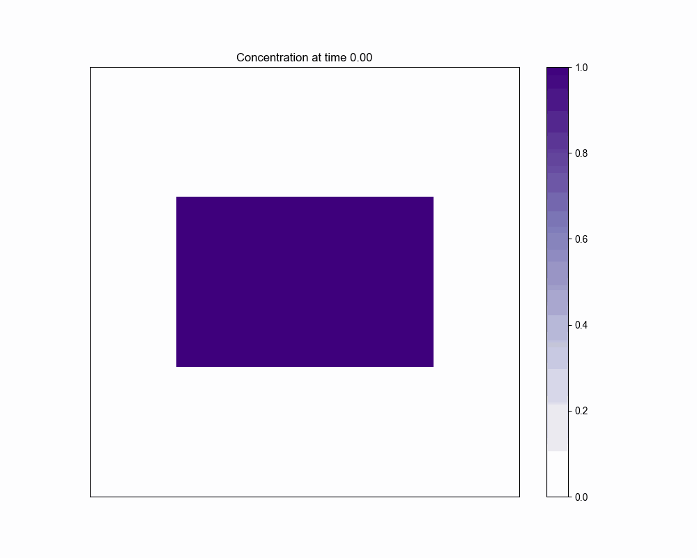
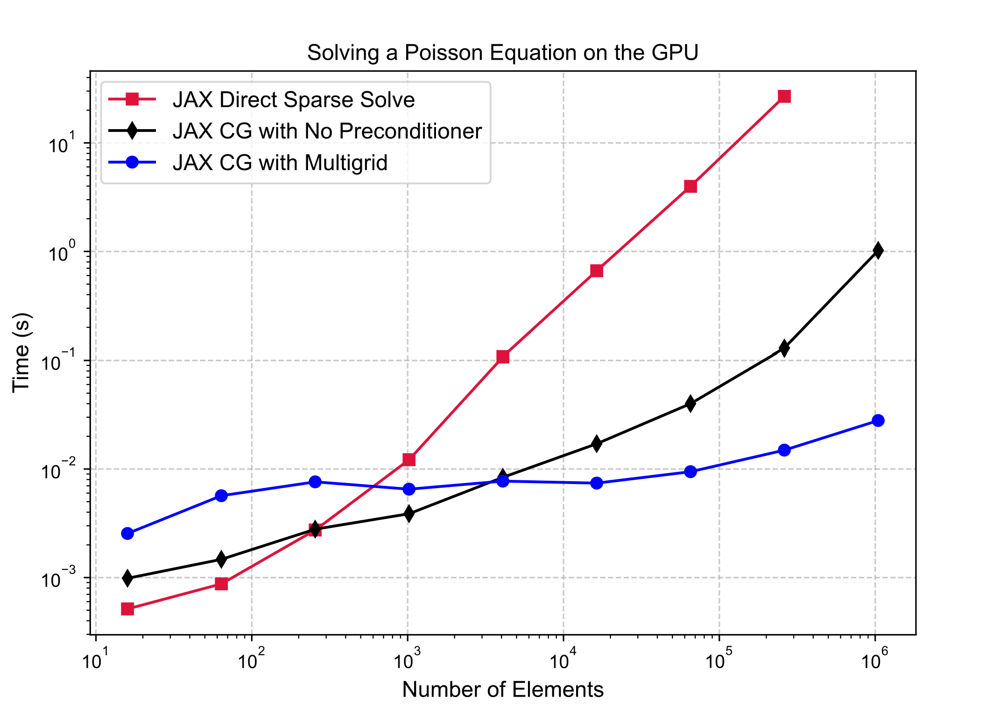
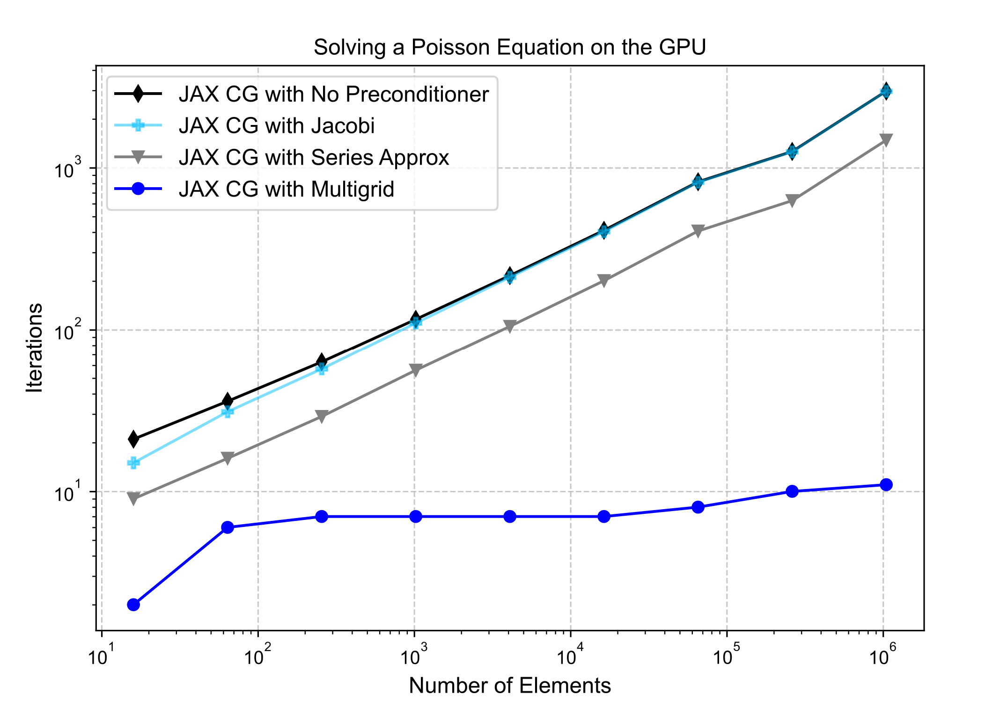
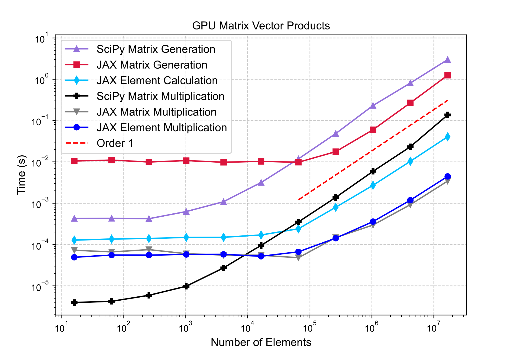
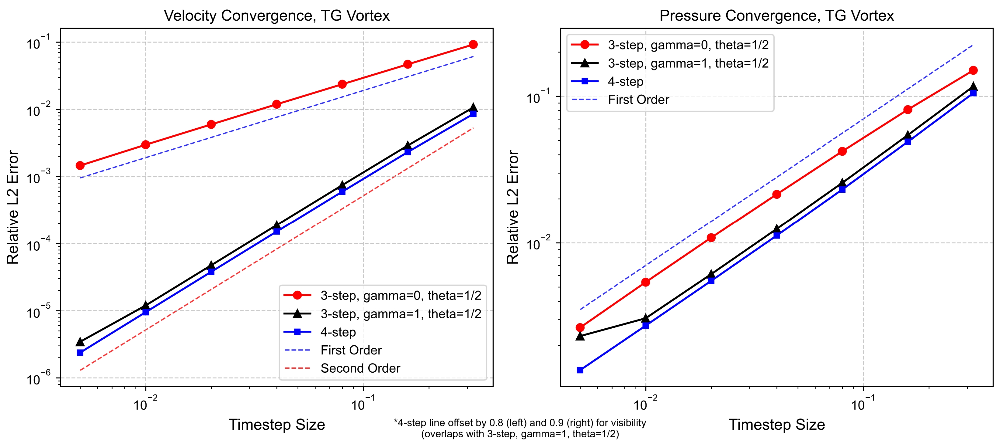
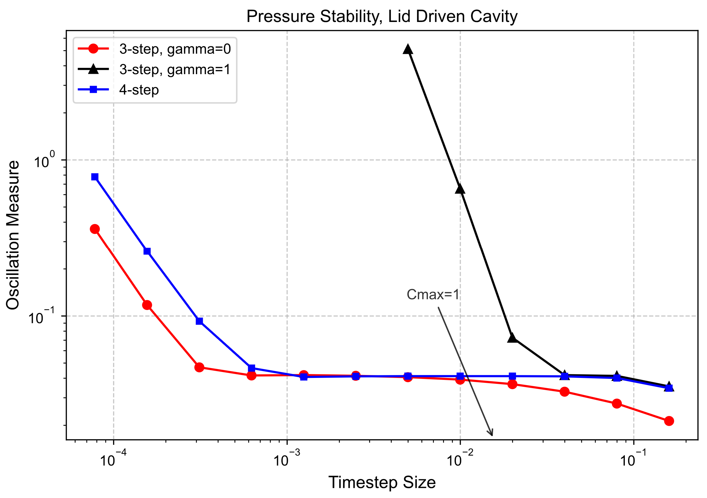
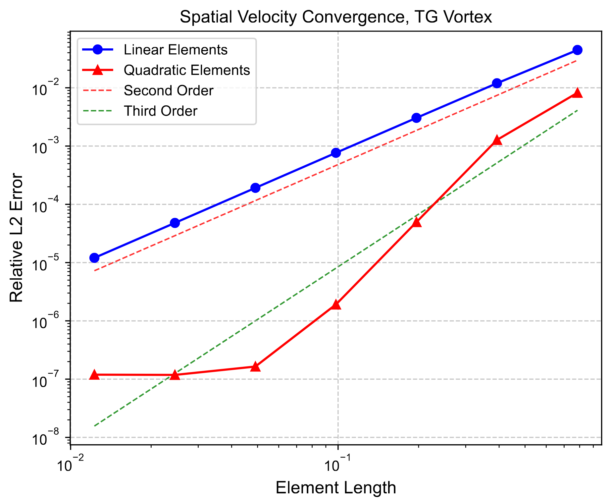
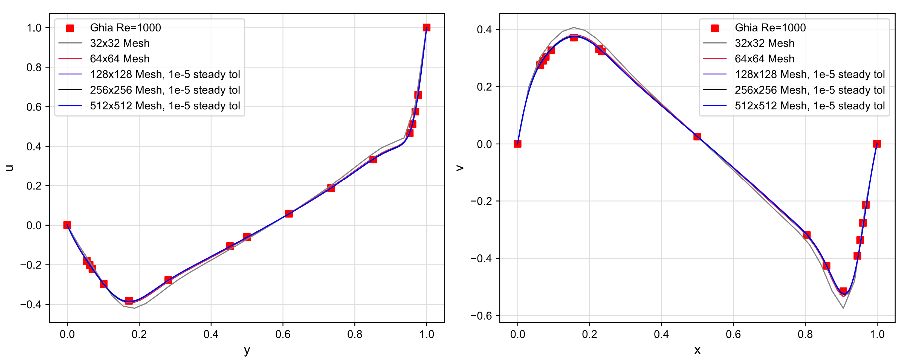

# Finite Elements for Incompressible Flows in JAX

I made this repository publicly available to showcase my work for an upcoming paper "An efficient differentiable finite element library for incompressible flows in JAX". Note that this repository is not finished, nor is it fully up to date with my local version. Until our paper is published, we kindly ask that you do not copy or redistribute this code. Once it is published, the code will be made fully open source and free for all use. 

## Highlights
### NU Inverse Problem
Here we use automatic differentiation to learn only the initial velocity field. The boundaries are all walls and the passive scalar is initially in a rectangular region. The learned initial velocity decays as it evolves via the Navier-Stokes equations, and transports the passive scalar into the desired shape as it evolves via the advection-diffusion equation.

    

### Another Passive Scalar Transport Example
The boundary conditions are the same as for the NU, but here the initial velocity is a slightly asymmetric "push" to the right and the viscosity is smaller. 

    

## Key Results
### Multigrid Preconditioning
Solving the pressure Poisson equation each timestep is the biggest bottleneck for speed due to poor conditioning as the number of elements increases. We use the conjugate gradient method with multigrid preconditioning to solve it. 

  
  

### Matrix-Free Computations
To perform a matrix vector product, you first need to "generate" your matrix, and then multiply a vector by it. The purple, red, and light blue lines are different options for generating a sparse finite element convection matrix. We use the light blue line, which doesn't assemble a global matrix but instead stores the element matrices. The black, grey, and dark blue lines are different options for performing a sparse matrix vector product. We uses the dark blue line, which performs the multiplication element by element and assembles the global product vector.

    

### 4-Step Pressure Projection
We use a 4-step pressure projection method for efficiency and temporal accuracy while avoiding pressure stability issues (for equal order interpolations). To understand these plots, some background information is needed. Without providing it here, you may refer to Codina, 2000 and Choi et al., 1996. These plots clarify some of the issues with these methods discussed in the literature through numerical experiments.

    

    

### Spatial Convergence
The Taylor-Green vortex with periodic boundary conditions is used to test spatial convergence (and temporal above). Note that the quadratic element error is limited by the fixed timestep size and solver tolerance.

    

### Lid Driven Cavity Benchmark
The classic Ghia, 1982 lid driven cavity solution is used as a benchmark. Note that this problem requires careful consideration with the finite element method because of the discontinuities at the lid corners. With finite elements, you must specify the velocity at these points. 

    

